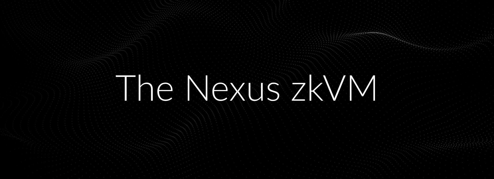

# The Nexus zkVM

<div align="left">
    <a href="https://t.me/nexus_zkvm">
        </a>
    <a href="https://github.com/nexus-xyz/nexus-zkvm/graphs/contributors">
        </a>
    <a href="https://twitter.com/NexusLabsHQ">
        </a>
    <a href="https://nexus.xyz">
        </a>
    <a href="https://github.com/nexus-xyz/nexus-zkvm/blob/main/LICENSE-MIT">
        </a>
    <a href="https://github.com/nexus-xyz/nexus-zkvm/blob/main/LICENSE-APACHE">
        </a>
</div>

<p align="center">
  <p align="center">
   
  </p>
</p>

The Nexus zkVM is a modular, extensible, open-source, and highly-parallelized zkVM, designed to run at *a trillion CPU cycles proved per second* given enough machine power.

## Folding schemes

If you're interested in our implementation of folding schemes, check the [`nexus-nova`](./nova/) crate.

## Quick Start

### 1. Install the Nexus zkVM

First, install Rust: https://www.rust-lang.org/tools/install.

Also, make sure you have a working version of [cmake](https://cmake.org/).

Next, install the RISC-V target:

```shell
rustup target add riscv32i-unknown-none-elf
```

Then, install the Nexus zkVM:

```shell
cargo install --git https://github.com/nexus-xyz/nexus-zkvm cargo-nexus --tag 'v0.2.1'
```

Verify the installation:

```shell
cargo nexus --help
```

This should print the available CLI commands.

### 2. Create a new Nexus project

```shell
cargo nexus new nexus-project
```

This will create a new Rust project directory with the following structure:

```shell
./nexus-project
├── Cargo.lock
├── Cargo.toml
└── src
    └── main.rs
```

As an example, you can change the content of `./src/main.rs` to:

```rust
#![cfg_attr(target_arch = "riscv32", no_std, no_main)]

fn fib(n: u32) -> u32 {
    match n {
        0 => 0,
        1 => 1,
        _ => fib(n - 1) + fib(n - 2),
    }
}

#[nexus_rt::main]
fn main() {
    let n = 7;
    let result = fib(n);
    assert_eq!(result, 13);
}
```

### 3. Run your program

```bash
cargo nexus run
```

This command should run successfully. To print the full step-by-step execution trace on the NVM, run:

```bash
cargo nexus run -v
```

### 4. Prove your program

Generate a proof for your Rust program using the Nexus zkVM.

```shell
cargo nexus prove
```

This command will save the proof to `./nexus-proof`.

### 5. Verify your proof

Finally, load and verify the proof:

```shell
cargo nexus verify
```

## Learn More

Run `cargo nexus --help` to see all the available commands.

Also check out the documentation at [docs.nexus.xyz](https://docs.nexus.xyz), or join our [Telegram](https://t.me/nexus_zkvm) chat to discuss!

Nexus is committed to open-source. All of our code is dual licensed under MIT and Apache licenses. We encourage and appreciate contributions.
